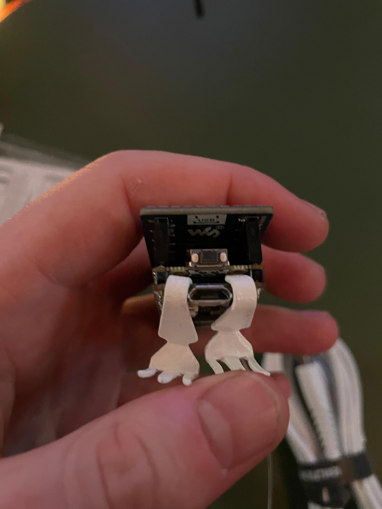

# _Coastline Paradox_

## mounting

  Included with the piece should be all materials needed for mounting:
  
  <ul>
    <li>two hooks to support the bottom of the LED grid</li>
    <ul>
      <li>these should be ca. 8mm apart, on either side of the microUSB port and inside the walls of the LED grid (see right)</li>
    </ul>
    <li>one hook for the optic fiber to hang from</li>
    <ul>
      <li>this hook should sit 10-12 cm above the top of the LED grid </li>
    </ul>
    <li>cable clips to secure the USB cable to the wall</li>
    <li>the piece should sit slightly above eye-height (ca. 190cm from the floor), inviting guests to direct their gaze slightly upward</li>
  </ul>

## power on/off

  <ul>
    <li>The piece needs to be plugged into a 220 volt wall socket to operate.</li>
    <li>Use only the included white USB-A to microUSB cable with the wall adaptor to power the piece.</li>
    <li>The piece should start shortly after it is connected to power [videoGoesHere]() </li>
    <li>The piece is turned on and off by connecting and disconnecting it to power.</li>
    <li>Once turned on, it will run until turned off.</li>
  </ul>

  
**If nothing happens after a few seconds - DON'T PANIC!**
 
  
Instead:

  <ul>
    <li>press the small black button on the bottom of the piece, located just above the microUSB port see image above</li>
    <li>a white LED underneath the main LED grid should turn on, and the piece should starup shortly after</li>    
  </ul>
  

## lighting
The piece can be lit with a warm spotlight at a relatively low level  

***
If there are any questions or issues with the installation, please don't hesistate to contact me via

EMAIL                                   |       |  PHONE
:--------------------------------------:|:-----:|:-------------------------:
 |       |  

